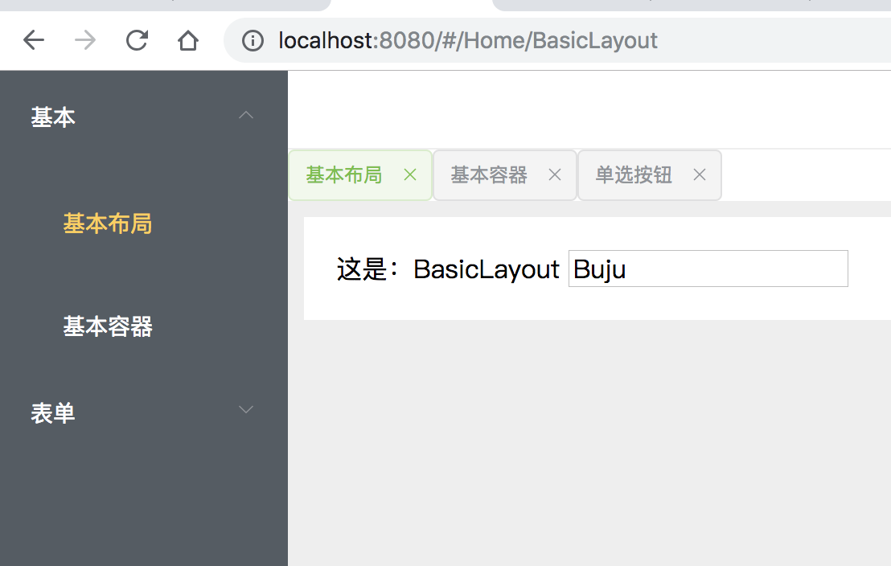

# v3-el-dashborad

the v3-el-dashborad is just a demo, and very easy to learn。But no default page or default router。

if you want a default page or router, you can add it by yourself。i believe you can make it。

if you want a completed dashborad, maybe you should see https://github.com/PanJiaChen/vue-element-admin



## 初始化
```
yarn install
yarn run serve

go to http://localhost:8080/#/Home/BasicLayout
go to http://localhost:8080/#/Home/BasicContainer
go to http://localhost:8080/#/Home/FormRadio
```
## 改进

- 使用vue-cli 3x
- 使用vuex
- 增加多标签页来控制控制路由


## 增加多标签页来控制控制路由

1. 使用keep-alive
2. 使用keep-alive include属性来指明哪些页面需要缓存
3. navTags由vuex来管理

```
<keep-alive :include="navTags">
  <router-view></router-view>
</keep-alive>
```

