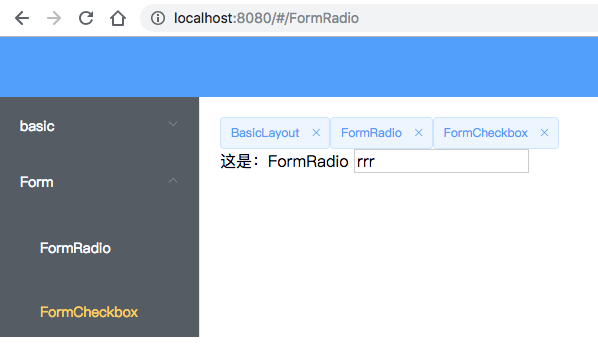

# v3-el-dashborad



## 初始化
```
yarn install
yarn run serve
```
## 改进

- 使用vue-cli 3x
- 使用vuex
- 增加多标签页来控制控制路由


## 增加多标签页来控制控制路由

1. 使用keep-alive
2. 使用keep-alive include属性来指明哪些页面需要缓存
3. navTags由vuex来管理

```
<keep-alive :include="navTags">
  <router-view></router-view>
</keep-alive>
```

